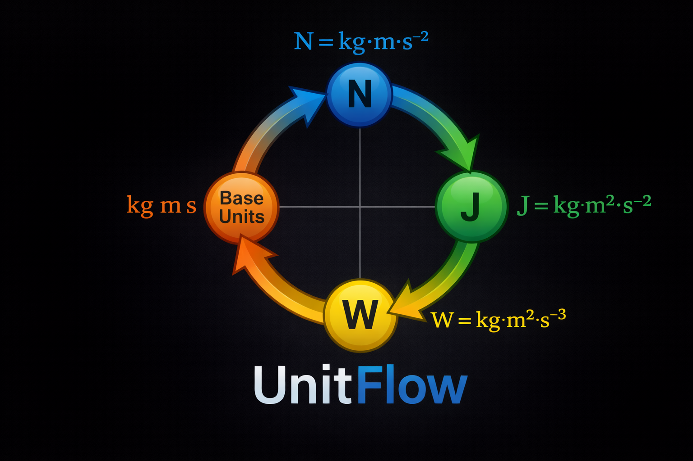

<p align="center">
  <br>
  <strong style="font-size: 2em;">UnitFlow</strong>
</p>
<p align="center">
  <a href="https://www.python.org/downloads/"></a>
  <a href="https://github.com/astral-sh/ruff"></a>
  <a href="https://mypy-lang.org/"></a>
  <a href="https://opensource.org/licenses/Apache-2.0"></a>
  <a href="https://github.com/ThunderGraph/unitflow"></a>
  <a href="https://github.com/ThunderGraph/unitflow"></a>
</p>

<p align="center">
  <strong>Elegant engineering math for Python.</strong><br>
  Unit algebra. Dimensional reasoning. Symbolic constraints. Array workflows.<br>
  Built for engineers who refuse to compromise on correctness or beauty.
</p>

<p align="center">
  <a href="#quick-start">Quick Start</a> &middot;
  <a href="#why-unitflow">Why UnitFlow</a> &middot;
  <a href="#features">Features</a> &middot;
  <a href="#examples">Examples</a> &middot;
  <a href="#installation">Installation</a> &middot;
  <a href="#contributing">Contributing</a>
</p>

---

## Why UnitFlow

Most unit libraries let you convert meters to feet. UnitFlow lets you **think in physics**.

```python
from unitflow import kg, m, s, N, symbol, Equation

# This just works.
force = 2 * kg * 9.81 * (m / s**2)
print(force.to(N))  # 19.62 N

# So does this.
F = symbol("F", unit=N)
mass = symbol("m", unit=kg)
a = symbol("a", unit=m / s**2)

newtons_law = F == mass * a  # Returns an Equation, not a bool.
```

UnitFlow was designed from the ground up as an **engineering math substrate** -- not a conversion utility, not a wrapper around strings, and not a half-measure bolted onto NumPy after the fact.

It is the computational foundation of [ThunderGraph](https://www.thundergraph.ai), an AI-powered model-based systems engineering platform. Every design decision optimizes for the same thing: **making engineering math feel like engineering math**.

---

## Quick Start

```python
from unitflow import m, cm, kg, s, N, Pa, kW, MW, rpm, rad, si

# Intuitive arithmetic
speed = 10 * m / s
area = 3 * m * 50 * cm
print(area.to(m**2))            # 1.5 m^2

# Exact conversions across orders of magnitude
power = 5000 * si.W
print(power.to(kW))             # 5 kW
print(power.to(MW))             # 0.005 MW

# Angular speed with exact pi-bearing scale factors
angular = (3000 * rpm).to(rad / s)
print(angular)                  # 314.159... rad/s

# Semantic equality: same physics, same object
assert 1 * m == 100 * cm
assert hash(1 * m) == hash(100 * cm)
```

---

## Features

### Clean Unit Algebra

Units are immutable, composable, and algebraically correct. Multiply them, divide them, raise them to powers. The dimension tracking is automatic and exact.

```python
velocity = m / s
acceleration = m / s**2
force_unit = kg * m / s**2

assert force_unit == N  # Semantic equivalence
```

### Exact Scale Representation

Unit definitions use exact rational arithmetic with explicit pi support. No floating-point drift in your conversion factors.

```python
from unitflow import rpm, rad, s

# rpm -> rad/s uses exact (1/30) * pi, not an approximation
speed = 3000 * rpm
angular = speed.to(rad / s)  # Exact pi-bearing conversion
```

### SI Prefix System

Every standard SI prefix from pico to tera, generated programmatically from exact rational factors. No hand-coded boilerplate.

```python
from unitflow import kW, MW, GW, kPa, MPa, GPa, kHz, GHz, nm, us

plant = 1200 * MW
print(plant.to(GW))   # 1.2 GW
print(plant.to(kW))   # 1200000 kW

wavelength = 550 * nm
cpu_clock = 3500 * MHz
response = 250 * us
```

### Torque vs Energy Disambiguation

Same physical dimension. Different engineering meaning. UnitFlow knows the difference.

```python
from unitflow import N, m, J, Quantity

torque = Quantity(12, (N * m).with_metadata(quantity_kind="torque"))
energy = Quantity(12, (N * m).with_metadata(quantity_kind="energy"))

print(torque)  # 12 N*m
print(energy)  # 12 J
```

### Symbolic Constraints for MBSE

Define engineering equations and constraints as first-class Python objects. Build executable system models, not dead documentation.

```python
from unitflow import symbol, N, kg, m, s, W, rpm, rad

# Define model variables
F = symbol("F", unit=N)
mass = symbol("m", unit=kg)
a = symbol("a", unit=m / s**2)

# Newton's second law as a constraint
newtons_law = F == mass * a

# Bounded variables
x = symbol("x", unit=m)
bounds = (0 * m <= x) & (x <= 10 * m)

# Negation
safe = ~(x > 100 * m)

# Full model example
shaft_speed = symbol("shaft_speed", unit=rpm)
shaft_torque = symbol("shaft_torque", unit=N * m, quantity_kind="torque")
shaft_power = symbol("shaft_power", unit=W)

power_eq = shaft_power == shaft_torque * shaft_speed.to(rad / s)
speed_bounds = (0 * rpm <= shaft_speed) & (shaft_speed <= 6000 * rpm)
```

### Expression Introspection

Every expression and constraint exposes a `free_symbols` property — the set of symbolic variables it depends on. This is the foundation for dependency graph construction in executable model engines.

```python
from unitflow import symbol, N, m, W, rad, s

torque = symbol("torque", unit=N * m)
speed = symbol("speed", unit=rad / s)
power = symbol("power", unit=W)

expr = torque * speed
print(expr.free_symbols)  # frozenset({torque, speed})

eq = power == torque * speed
print(eq.free_symbols)    # frozenset({power, torque, speed})
```

### Expression Evaluation

Push realized values into an expression tree and get a concrete `Quantity` back. Constraints evaluate to `bool` with explicit tolerance parameters — no global state.

```python
from unitflow import Quantity, symbol, N, m, W, rad, s

torque = symbol("torque", unit=N * m)
speed = symbol("speed", unit=rad / s)
power = symbol("power", unit=W)

# Evaluate an expression
expr = torque * speed
result = expr.evaluate({torque: Quantity(50, N * m), speed: Quantity(314, rad / s)})
print(result)  # 15700 N*m/s

# Evaluate a constraint
eq = power == torque * speed
ctx = {torque: Quantity(50, N * m), speed: Quantity(100, rad / s), power: Quantity(5000, N * m / s)}
print(eq.evaluate(ctx))                        # True
print(eq.evaluate(ctx, rel_tol=0.001))         # True (custom tolerance)
```

### Numeric Compilation for Solvers

Compile expression trees into fast bare-float Python functions. All unit conversions and constants are baked in at compile time. The resulting callable is suitable for inner loops of numeric solvers like `scipy.optimize.root`.

```python
from unitflow import symbol, N, m, rad, s
from unitflow.expr.compile import compile_numeric, compile_residual

torque = symbol("T", unit=N * m)
speed = symbol("w", unit=rad / s)
power = symbol("P", unit=N * m / s)

# Compile an expression to a fast float function
fn = compile_numeric(torque * speed, [torque, speed], {torque: N * m, speed: rad / s})
print(fn(50.0, 314.0))  # 15700.0 — pure float, no Quantity overhead

# Compile an equation into a residual function (lhs - rhs)
eq = power == torque * speed
residual = compile_residual(eq, [power, torque, speed], {power: N * m / s, torque: N * m, speed: rad / s})
print(residual(5000.0, 50.0, 100.0))  # 0.0 — at the solution
print(residual(9999.0, 50.0, 100.0))  # 4999.0 — away from the solution
```

### NumPy Array Workflows

Array-backed quantities follow the same semantic rules as scalars. No separate "array mode." No monkey-patching.

```python
import numpy as np
from unitflow import Quantity, kg, m, s, rad

masses = Quantity(np.array([1.0, 2.0, 5.0, 10.0]), kg)
accels = Quantity(np.array([9.81, 9.81, 9.81, 9.81]), m / s**2)
forces = masses * accels

print(np.sum(forces))   # 176.58 kg*m/s^2
print(np.mean(forces))  # 44.145 kg*m/s^2

# Trig functions enforce dimensionless inputs
angles = Quantity(np.array([0, np.pi/2, np.pi]), rad)
print(np.sin(angles))   # [0, 1, 0] -- dimensionless result
```

### User-Defined Units and Extensibility

Define your own units and domain packs without touching library internals.

```python
from unitflow import define_unit, UnitNamespace, Quantity, m, s, generate_prefixes
from fractions import Fraction

# Define a custom unit
ft = define_unit(name="foot", symbol="ft", expr=Quantity(Fraction(3048, 10000), m))
print((6 * ft).to(m))  # 1.8288 m

# Create a domain namespace
aero = UnitNamespace("aero")
knot = aero.define_unit(name="knot", symbol="kn", expr=Quantity(Fraction(1852, 3600), m / s))

# Generate prefixed variants automatically
generate_prefixes(aero, knot, include={"milli", "kilo"})
```

### JSON-Safe Serialization

Quantities, expressions, and constraint trees serialize to plain dicts. No pickle. No magic. Ready for distributed workflows.

> **Note:** Serialization currently only supports scalar magnitudes (`int`, `float`, `Fraction`). Array-backed quantities from the NumPy backend are not currently serializable and will raise a `SerializationError`.

```python
import json
from unitflow import serialize_quantity, deserialize_quantity, rpm

q = 3000 * rpm
data = serialize_quantity(q)
print(json.dumps(data, indent=2))

restored = deserialize_quantity(json.loads(json.dumps(data)))
assert restored == q
```

### Explicit Error Handling

Dimension mismatches fail loudly. Incompatible conversions fail loudly. Constraints refuse to be booleans. No silent corruption.

```python
from unitflow import m, s, DimensionMismatchError, IncompatibleUnitError

try:
    _ = (3 * m) + (2 * s)
except DimensionMismatchError:
    print("Can't add meters and seconds.")

try:
    (3 * m).to(s)
except IncompatibleUnitError:
    print("Can't convert meters to seconds.")
```

---

## Installation

```bash
pip install unitflow
```

For NumPy support:

```bash
pip install unitflow[numpy]
```

> **Note:** The core library has zero dependencies. NumPy is optional and only needed for array-backed workflows.

---

## Architecture

UnitFlow is built in clean, composable layers:

| Layer | Purpose |
|-------|---------|
| **Dimension Algebra** | Immutable exponent vectors over SI base dimensions |
| **Exact Scale** | Rational coefficients with explicit pi powers |
| **Unit Semantics** | Immutable units with algebraic composition |
| **Quantity Core** | Concrete arithmetic, conversion, semantic equality |
| **Display Resolution** | Engineering-friendly formatting with ambiguity handling |
| **Definition System** | Keyword-first `define_unit()`, namespaces, prefix generation |
| **Catalogs** | Curated SI and mechanical unit packs |
| **Expression Layer** | Symbolic variables, expressions, and constraint trees |
| **Expression Ops** | Introspection (`free_symbols`), evaluation, and numeric compilation for solvers |
| **Serialization** | Structural JSON-safe serialization for all objects |
| **NumPy Backend** | Optional array integration via `__array_ufunc__` |

The semantic core imports cleanly without NumPy. The expression layer does not pollute quantity arithmetic. Display logic does not affect semantic truth. Every layer depends downward, never upward.

---

## Designed For

- **Mechanical engineers** working with force, torque, pressure, and power
- **Electrical engineers** working with voltage, current, and frequency
- **Aerospace engineers** working with thrust, drag, and angular velocity
- **Controls engineers** working with transfer functions and system dynamics
- **Simulation engineers** coupling models across tools and domains
- **AI/ML engineers** building physics-informed models with correct units
- **Anyone** who has ever been burned by a silent unit mismatch

---

## Part of ThunderGraph

UnitFlow is the foundational math layer for [ThunderGraph](https://github.com/ThunderGraph), an AI-powered model-based systems engineering platform that replaces dead SysML notation with executable Python models.

If you are building digital twins, system simulations, or engineering optimization workflows, UnitFlow gives you the dimensional correctness and algebraic elegance that your models deserve.

---

## Contributing

UnitFlow is open source and welcomes contributions. Please read [CONTRIBUTING.md](CONTRIBUTING.md) before submitting a pull request.

---

## License

Apache 2.0

---

<p align="center">
  <strong>Stop converting. Start computing.</strong>
</p>
