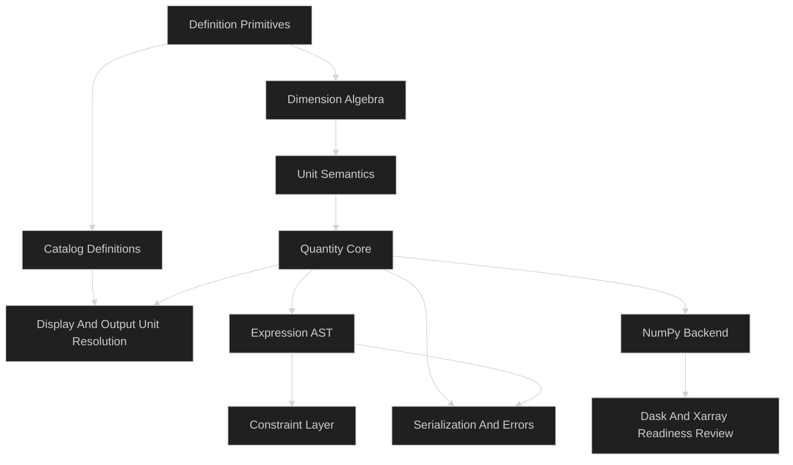

# Unitflow Implementation Plan

## Table Of Contents

1. [Purpose](#purpose)
2. [Planning Principles](#planning-principles)
3. [Delivery Methodology](#delivery-methodology)
4. [Target Architecture](#target-architecture)
5. [Proposed File Tree](#proposed-file-tree)
6. [Phase Plan](#phase-plan)
   - [Phase 1: Core Semantic Foundation](#phase-1-core-semantic-foundation)
   - [Phase 2: Unit Semantics](#phase-2-unit-semantics)
   - [Phase 3: Quantity Core](#phase-3-quantity-core)
   - [Phase 4: Definition System And First Catalogs](#phase-4-definition-system-and-first-catalogs)
   - [Phase 5: Display Resolution, Output Units, And Semantic Metadata](#phase-5-display-resolution-output-units-and-semantic-metadata)
   - [Phase 6: Expression And Constraint Layer](#phase-6-expression-and-constraint-layer)
   - [Phase 7: Serialization And Error Boundaries](#phase-7-serialization-and-error-boundaries)
   - [Phase 8: NumPy Backend](#phase-8-numpy-backend)
   - [Dask And Xarray Readiness Review](#dask-and-xarray-readiness-review)
7. [Phase Gate Test Strategy](#phase-gate-test-strategy)
8. [Cross-Cutting Design Rules](#cross-cutting-design-rules)
9. [Risks And Watch Items](#risks-and-watch-items)
10. [Go/No-Go Summary](#gono-go-summary)
11. [References](#references)

## Purpose

This document turns the current `unitflow` design work into an implementation plan.

The plan is optimized for:

- a clean and durable algebra core
- strong engineering semantics
- readable and maintainable code
- phased delivery with explicit go/no-go gates
- testing at every phase boundary

This plan intentionally favors a simpler and more elegant implementation path over ambitious breadth.
The project should earn complexity only when a prior phase has proven its foundations.

## Planning Principles

The implementation should follow the ThunderGraph design philosophy:

- prefer simpler and easier-to-understand architectures as long as they meet requirements
- keep functions focused and short
- keep object responsibilities narrow and explicit
- do not merge unrelated concerns into a single clever abstraction
- validate each layer before building the next one

Additional planning principles for `unitflow`:

- build the semantic core before integrations
- keep concrete arithmetic separate from symbolic expression handling
- prefer exact internal semantics over magical user-facing heuristics
- preserve extensibility through stable primitives rather than early framework complexity
- make testing part of every gate, not a cleanup step at the end

## Delivery Methodology

The implementation should be delivered as a sequence of narrow vertical slices.

Each slice should:

- introduce one major capability area
- include unit tests for the new local behavior
- include integration tests proving the capability composes with prior layers
- end in a go/no-go review before the next phase begins

The plan also needs to acknowledge a few implementation realities up front:

- operator overloading in early concrete phases must leave room for later symbolic dispatch
- quantity hashing must align with semantic equality
- useful developer-facing `__repr__` output should exist before pretty display heuristics arrive
- NumPy support should remain an optional integration concern until the dedicated backend phase
- Python operator methods must use `NotImplemented` correctly so reflected arithmetic and later symbolic comparison dispatch can work

This project should not start by trying to build:

- all units
- all symbolic behavior
- all array integrations
- all digital twin or solver features

Instead, it should establish a small but rigorous center:

1. dimension algebra
2. exact unit semantics
3. quantity arithmetic and conversion
4. display and semantic metadata
5. expression and constraint trees
6. serialization and error boundaries
7. array backends

That order is deliberate.
It reduces architectural risk and keeps the early codebase understandable.

## Target Architecture

The implementation should preserve a clean separation between semantic layers.



Implementation dependency rules:

- `Dimension` must not depend on `Unit`
- `Unit` may depend on `Dimension`
- `Quantity` may depend on `Unit`
- `Expr` and `Constraint` may depend on `Quantity`, `Unit`, and `Dimension`
- definition and catalog layers may depend on the semantic core, but not on expression or backend layers
- backends and adapters must depend on the semantic core, not the other way around

## Proposed File Tree

This is the recommended initial file tree for implementation.
It is intentionally modest.

```text
unitflow/
    __init__.py
    errors.py

    core/
        __init__.py
        dimensions.py
        scale.py
        unit_families.py
        units.py
        quantities.py
        display.py
        conversion.py
        kinds.py

    expr/
        __init__.py
        symbols.py
        expressions.py
        constraints.py
        logical.py
        normalize.py
        substitute.py

    define/
        __init__.py
        registry.py
        namespaces.py
        define_unit.py

    catalogs/
        __init__.py
        si.py
        mechanical.py

    serialization/
        __init__.py
        quantities.py
        expressions.py

    backends/
        __init__.py
        numpy.py

tests/
    unit/
        core/
        expr/
        define/
        catalogs/
        serialization/
        backends/
    integration/
        core/
        expr/
        workflows/
```

Rationale:

- `core` owns the semantic model
- `expr` owns symbolic and constraint behavior
- `define` owns extensibility primitives
- `catalogs` ships first-party unit packs
- `serialization` prevents ad hoc object dumping logic from leaking everywhere
- `backends` contains integration layers without polluting the core

Dependency note:

- `numpy` should be treated as an optional integration dependency until the NumPy backend phase
- the semantic core should remain importable and testable without requiring NumPy
- `core/kinds.py` should remain minimal until Phase 5, when `quantity_kind` becomes active in concrete display and metadata handling

## Phase Plan

## Phase 1: Core Semantic Foundation

### Objective

Establish the smallest rigorous semantic core and package foundation in one pass.

This phase intentionally folds package skeleton work into the first real semantic milestone.
Creating empty files is not a phase.

### In Scope

- package layout and import boundaries
- base exception hierarchy
- immutable `Dimension`
- exact `Scale` model using rational coefficient times integer powers of `pi`
- base operations on dimensions and scales
- equality, hashing, and normalization utilities
- unit-family metadata container for pseudo-dimensionless units

### Out Of Scope

- named units
- quantities
- display heuristics
- symbolic expressions

### Deliverables

- package/module skeleton that already supports real semantic code
- initial exception categories used by the semantic layer
- `Dimension` implementation
- `Scale` implementation
- unit-family metadata primitives for pseudo-dimensionless units

### Go/No-Go Gate

Go if:

- dimensions are immutable, hashable, and cheap to compare
- scale composition works exactly for rational and `pi`-bearing definitions
- the model can represent `rad`, `turn`, and `rpm` prerequisites without contaminating the dimension algebra
- the package structure supports the implemented semantic core without circular import pressure

No-go if:

- scale logic starts turning into a generic symbolic system
- dimension operations are not deterministic
- the implementation requires hidden floating-point normalization
- the packaging structure is already forcing awkward import workarounds

### Required Tests

Unit tests:

- import tests for public semantic modules
- error class import and inheritance sanity checks
- dimension multiply/divide/power behavior
- equality and hashing for equivalent dimensions
- exact scale composition for `cm`, `minute`, `turn`
- cancellation behavior for `pi` powers and rational coefficients

Integration tests:

- combined dimension-plus-scale normalization for representative unit definitions
- pseudo-dimensionless unit-family metadata retention across construction

Acceptance scenarios:

- importing the semantic core does not require NumPy
- `turn = 2*pi*rad` can be represented exactly
- `rpm` prerequisites can be modeled without adding an eighth base dimension

## Phase 2: Unit Semantics

### Objective

Implement `Unit` as a first-class immutable semantic object before introducing quantity arithmetic.

### In Scope

- immutable `Unit`
- unit construction from dimensions, scales, and metadata
- compatibility checking between units
- unit multiplication/division/power
- semantic equality and hashing for units
- conservative developer-facing `__repr__` for units

### Out Of Scope

- quantity arithmetic
- result display heuristics
- symbolic promotion
- constraint operators

### Deliverables

- `Unit`
- unit algebra
- compatibility and conversion-factor preparation utilities
- baseline unit `__repr__` suitable for debugging

### Go/No-Go Gate

Go if:

- units compose algebraically and immutably
- unit hashing aligns with semantic equality
- conversion factors between compatible units can be derived exactly
- unit debug output is readable enough for development work

No-go if:

- unit algebra depends on quantity code
- unit hashes drift from semantic equality
- unit metadata leaks into semantic compatibility logic

### Required Tests

Unit tests:

- unit multiply/divide/power behavior
- unit equality and hashing for semantically equivalent definitions
- compatibility checks for compatible and incompatible unit pairs
- conversion-factor derivation for rational and `pi`-bearing units
- readable `__repr__` smoke tests for unit debugging

Integration tests:

- representative unit construction flows from the definition primitives
- exact semantic equivalence such as `N == kg*m/s^2`

Acceptance scenarios:

- a manually constructed meter unit multiplied by a manually constructed centimeter unit yields a unit with area semantics
- a manually constructed `rpm`-equivalent unit can derive an exact conversion factor to `rad/s`

## Phase 3: Quantity Core

### Objective

Implement concrete quantity behavior on top of the semantic unit core.

### In Scope

- immutable `Quantity`
- quantity arithmetic for concrete values
- exact conversion mechanics
- concrete equality behavior
- explicit `.to(...)`
- concrete `__hash__` aligned with semantic equality
- conservative developer-facing `__repr__` for quantities
- operator overload design that anticipates later symbolic dispatch
- reflected arithmetic behavior such as `__rmul__`

### Out Of Scope

- symbolic promotion
- constraint operators
- smart derived-unit display selection beyond basic correctness
- NumPy-specific dispatch

### Deliverables

- `Quantity`
- additive and multiplicative arithmetic
- conversion and compatibility checking
- exact versus inexact comparison behavior
- baseline error behavior for invalid arithmetic and conversion
- stable semantic-hash behavior for concrete quantities
- debug-usable `__repr__`

### Go/No-Go Gate

Go if:

- concrete arithmetic is correct and predictable
- incompatible operations fail cleanly
- exact unit conversions work for rational and `pi`-bearing units
- float-backed quantities use explicit closeness APIs rather than hidden tolerance
- semantically equivalent concrete quantities hash identically
- quantity operator design leaves a clean path for symbolic promotion in the later expression phase

No-go if:

- equality behavior is ambiguous
- conversions leak display logic into semantic logic
- quantity operations are already entangled with symbolic concerns
- quantity hashing disagrees with semantic equality

### Required Tests

Unit tests:

- add/subtract with compatible and incompatible dimensions
- multiply/divide/power on quantities
- conversion of length, area, frequency, and angular-speed-related quantities
- exact equality for exact-capable numerics
- explicit `is_close(...)` behavior for inexact numerics
- quantity equality and hash alignment for semantically equivalent values
- invalid operation error coverage
- readable `__repr__` smoke tests for quantity debugging
- right-multiply behavior such as `3 * unit`

Integration tests:

- end-to-end examples such as `3 * m * 33 * cm -> 0.99 m^2`
- `rpm` to `rad/s` conversion
- `turn`, `cycle`, and `rad` interactions in concrete quantities

Acceptance scenarios:

- `3 * m + 33 * cm` succeeds while `3 * m + 2 * s` raises a dimension-mismatch error
- `3 * m * 33 * cm` is semantically equal to `0.99 * m**2`
- `3000 * rpm` converts to angular speed through exact `pi`-bearing semantics
- `3 * m` and `300 * cm` behave identically in sets and dict keys
- `3 * meter_unit` succeeds through reflected multiplication rather than requiring an explicit quantity constructor

## Phase 4: Definition System And First Catalogs

### Objective

Make the system extensible and ship the first curated unit packs needed to drive real display and workflow behavior.

### In Scope

- keyword-first `define_unit(...)`
- namespaces and registries
- first-party SI catalog
- first-party mechanical starter pack
- alias handling

### Out Of Scope

- every engineering domain
- parsing broad free-form unit strings
- plugin discovery frameworks

### Deliverables

- stable unit-definition API
- namespace infrastructure
- SI pack
- mechanical starter pack including units needed for `rpm`, `psi`, and common engineering flows

### Go/No-Go Gate

Go if:

- new units can be defined without touching core internals
- alias behavior is deterministic
- namespaces feel clean and non-magical
- the first shipped catalogs are enough to exercise real workflows and display resolution inputs

No-go if:

- the definition API is still drifting
- registries reintroduce hidden global-state complexity
- new units require bespoke code in core modules

### Required Tests

Unit tests:

- `define_unit(...)` validation
- alias resolution
- namespace isolation and composition
- SI and mechanical catalog correctness

Integration tests:

- user-defined unit creation in normal application code
- mixed usage of first-party and user-defined namespaces
- representative mechanical workflows using `rpm`, torque, pressure, and output-unit conversion

Acceptance scenarios:

- a user can define `ksi` without editing core code
- `rpm`, `N`, `Pa`, `J`, and `W` are available for downstream display and workflow tests

## Phase 5: Display Resolution, Output Units, And Semantic Metadata

### Objective

Separate semantic correctness from user-facing result presentation.

### In Scope

- default display resolution
- explicit output unit control
- `quantity_kind`
- named derived unit preference rules
- ambiguous display fallback rules

### Out Of Scope

- symbolic expression display rules
- advanced domain-specific formatting policies
- adaptive heuristics beyond the documented defaults

### Deliverables

- display resolver
- output-unit selection behavior
- `quantity_kind` support for concrete quantities
- conservative handling of ambiguous derived-unit mappings such as torque vs energy
- upgraded `__repr__` / `__str__` behavior for concrete quantities

### Go/No-Go Gate

Go if:

- default displays are deterministic and engineering-friendly
- explicit target units always override defaults cleanly
- ambiguous cases fall back conservatively rather than misleadingly
- `quantity_kind` is metadata, not hidden algebra
- developer-visible quantity formatting is now good enough to replace the earlier debug-only representation

No-go if:

- display selection changes arithmetic meaning
- torque begins auto-rendering as joules without a semantic hint
- the display layer becomes a tangle of special cases

### Required Tests

Unit tests:

- named derived unit preference where unambiguous
- compound-unit fallback where ambiguous
- explicit `.to(...)` overriding default display
- `quantity_kind` influence on display selection
- stability of display caching behavior

Integration tests:

- torque vs energy formatting scenarios
- machinist/reporting output-unit scenarios
- multi-step calculations where intermediate units differ from final delivery units

Acceptance scenarios:

- torque defaults to `N*m` unless semantic hints justify a different display
- energy may display as `J` when the quantity kind or explicit unit selection supports it
- a machinist-facing output request forces final units regardless of intermediate calculation units

## Phase 6: Expression And Constraint Layer

### Objective

Implement the native symbolic model needed for executable MBSE semantics.

This phase is intentionally broad because the public symbolic surface is tightly connected.
If implementation complexity starts rising, the approved fallback is to split the work internally into:

1. expression construction and arithmetic promotion
2. constraint objects and logical composition

### In Scope

- `Symbol`
- `Expr`
- arithmetic promotion rules
- `Equation`
- `StrictInequality`
- `NonStrictInequality`
- `&`, `|`, `~`
- constraint trees
- boolean-coercion failures
- operator dispatch from concrete quantities into symbolic expressions

### Out Of Scope

- deep symbolic simplification
- external CAS integration
- general-purpose solver implementation

### Deliverables

- native expression tree
- constraint tree model
- substitution and traversal basics
- normalization sufficient for dimension checking and solver-facing preparation
- explicit dispatch behavior across `Quantity`, `Symbol`, and `Expr`
- correct `NotImplemented`-based operator behavior where Python dispatch requires it

### Go/No-Go Gate

Go if:

- concrete and symbolic paths remain cleanly separated
- promotion to `Expr` is predictable and testable
- constraint operators produce inspectable trees
- invalid boolean coercion fails loudly and clearly
- Phase 3 quantity operator behavior can be extended rather than rewritten

No-go if:

- the symbolic layer starts absorbing concrete arithmetic behavior unnecessarily
- constraint composition is opaque or uninspectable
- normalization drifts toward a half-built CAS
- symbolic dispatch requires invasive redesign of concrete quantity operators

### Required Tests

Unit tests:

- `symbol(...)` construction rules
- promotion behavior for every mixed arithmetic combination
- equation and inequality construction
- negation, conjunction, and disjunction tree behavior
- boolean coercion errors
- dimension validation of expression trees
- dispatch behavior for `Quantity op Symbol`, `Quantity op Expr`, and `Symbol op Expr`
- comparison fallback behavior when the left operand cannot directly produce the symbolic result

Integration tests:

- ThunderGraph-style authoring examples from `docs/api-sketch.md`
- bounded variable expressions
- mixed concrete and symbolic expression construction
- solver-facing normalization smoke tests

Acceptance scenarios:

- `pressure * area` promotes to `Expr`, not `Quantity`
- `5 * si.N == force` and `force == 5 * si.N` produce equivalent constraint objects
- `(0 <= x) & (x <= 10)` produces an inspectable conjunction tree
- comparison dispatch works without forcing concrete quantity code to know the full symbolic implementation in advance

## Phase 7: Serialization And Error Boundaries

### Objective

Make quantities, expressions, and constraints structurally movable across process and workflow boundaries.

### In Scope

- structural serialization for quantities
- structural serialization for expressions and constraints
- canonical identity preservation
- error hierarchy refinement

### Out Of Scope

- final wire protocol commitment
- remote execution framework integration

### Deliverables

- serialization models for core objects
- round-trip reconstruction support
- stable error categories used consistently across layers

### Go/No-Go Gate

Go if:

- quantities and expression trees round-trip without semantic loss
- canonical unit identity survives serialization
- errors are specific enough to drive debugging and integration behavior

No-go if:

- serialization depends on Python object identity tricks
- display-only details leak into semantic reconstruction
- error handling is still generic and inconsistent

### Required Tests

Unit tests:

- quantity serialization round-trip
- expression serialization round-trip
- constraint serialization round-trip
- error class coverage and mapping behavior

Integration tests:

- cross-module serialization/deserialization flows
- realistic model-expression round trips preserving units, `quantity_kind`, and constraint structure

Acceptance scenarios:

- a serialized quantity preserves canonical unit identity and semantic metadata
- a serialized constraint tree round-trips without losing logical structure

## Phase 8: NumPy Backend

### Objective

Support array-backed engineering computation without compromising the semantic core.

### In Scope

- array-valued quantities
- NumPy ufunc dispatch
- selected `__array_function__` support where necessary
- broadcasting, reduction, and dimension checks

### Out Of Scope

- Dask execution
- xarray integration
- full scientific stack coverage

### Deliverables

- NumPy-aware quantity behavior
- explicit support for core arithmetic, reductions, and dimension-sensitive functions

### Go/No-Go Gate

Go if:

- array operations preserve unit semantics
- invalid dimension usage in functions such as trig/log/exp fails predictably
- the NumPy layer does not force redesign of the core semantic model
- NumPy remains an optional integration dependency rather than a hard requirement for core imports

No-go if:

- NumPy support requires invasive hacks throughout the core
- array semantics diverge from scalar semantics
- performance overhead becomes structurally unreasonable
- importing the semantic core requires NumPy

### Required Tests

Unit tests:

- quantity creation from `numpy.ndarray`
- arithmetic and broadcasting
- reductions such as `sum` and `mean`
- dimension-sensitive ufunc behavior
- comparison and conversion on arrays

Integration tests:

- realistic vectorized engineering calculations
- mixed scalar-array quantity flows
- output-unit conversion in array results

Acceptance scenarios:

- scalar and array quantity arithmetic follow the same semantic rules
- trigonometric and logarithmic NumPy operations reject invalid unit-bearing inputs predictably

## Dask And Xarray Readiness Review

### Purpose

This is a review gate, not a delivery phase.

Its job is to decide whether the implemented core is actually ready for lazy and labeled-array workflows before committing to more backend work.

### Review Questions

- does the core avoid eager array coercion in backend-independent paths?
- are serialization and semantic metadata robust enough for distributed execution?
- can conversion and display logic remain backend-agnostic?
- is the NumPy backend semantically aligned enough to justify moving outward?

### Review Evidence

Unit tests:

- no eager NumPy coercion in backend-independent paths
- metadata preservation under deferred construction patterns

Integration tests:

- dry-run workflows simulating lazy backends with stub array types
- readiness checks around structural serialization and explicit output-unit requests

### Go/No-Go Outcome

Go if:

- laziness would not be broken by current core assumptions
- metadata propagation looks robust enough to extend
- the current design can support a labeled-array layer without reworking the semantic core

No-go if:

- lazy or distributed execution would force eager materialization
- metadata propagation remains too fragile
- output-unit or display logic is too tightly coupled to concrete quantity materialization

## Phase Gate Test Strategy

Each phase gate should require both unit and integration testing.
Each phase should also include a short set of named acceptance scenarios that act as human-readable gate criteria.

### Unit Tests

Unit tests should prove:

- local correctness of the new layer
- edge-case handling
- clear failure behavior
- invariants for exactness, immutability, and promotion

Unit tests should stay focused and small.
They should target one behavior at a time.
They should not try to prove the entire phase in one oversized test.

### Integration Tests

Integration tests should prove:

- the new layer composes with earlier phases
- realistic engineering scenarios still read cleanly
- public APIs behave as the docs claim
- prior guarantees remain intact

Integration tests should be organized around named workflow scenarios, not vague categories.
If a phase cannot produce a few concrete acceptance scenarios, the phase is probably too vague.

Every gate should include at least a few tests derived directly from the public examples in:

- `docs/api-sketch.md`
- `docs/architecture-decisions.md`
- `docs/backend-methodology.md`

This keeps the implementation aligned with the design documents.

### Acceptance Scenarios

Acceptance scenarios are not a replacement for unit or integration tests.
They are the short list of concrete outcomes that a phase must visibly satisfy before the gate review.

Good acceptance scenarios look like:

- "`3 * m + 33 * cm` succeeds while `3 * m + 2 * s` fails with a dimension mismatch"
- "`3000 * rpm` converts through exact `pi`-bearing semantics into angular speed"
- "`5 * si.N == force` and `force == 5 * si.N` build equivalent symbolic constraints"

Every implementation phase in this plan includes such scenarios on purpose.

## Cross-Cutting Design Rules

These rules apply across all phases:

- keep public APIs small
- keep internal types immutable unless mutability is clearly justified
- keep formatting concerns out of semantic core logic
- keep registry and namespace logic out of arithmetic primitives
- keep symbolic logic out of concrete arithmetic unless promotion is explicitly required
- use precise, domain-relevant error messages
- avoid long multi-purpose functions
- favor boring code over clever code

## Risks And Watch Items

These issues should be watched continuously during implementation:

- `quantity_kind` propagation strategy
- unit-family metadata propagation for pseudo-dimensionless units
- exact scale simplification under repeated composition
- drift between display heuristics and semantic truth
- accidental leakage of symbolic concerns into concrete quantity code
- accidental eager materialization in future array backends

None of these risks justify premature abstraction.
They justify disciplined tests and explicit gate reviews.

## Go/No-Go Summary

The project should only proceed from one phase to the next when:

- the current phase's scope is implemented cleanly
- unit tests for the phase are green
- integration tests for the phase are green
- the new code does not force redesign of prior layers
- the public API remains consistent with the design docs

If a phase fails its gate, the correct action is to simplify, correct, or narrow the design before continuing.
The correct action is not to bury unresolved problems under the next phase.

## References

Internal references:

- `docs/brainstorm.md`
- `docs/architecture-decisions.md`
- `docs/api-sketch.md`
- `docs/backend-methodology.md`

No external references are required for this implementation plan at this stage.
