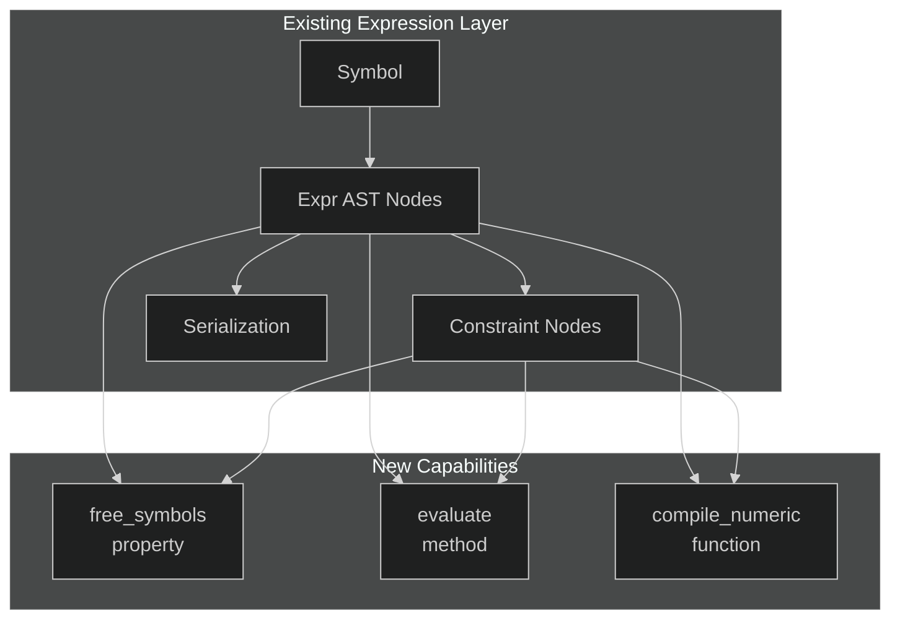

# unitflow Expression Operations Implementation Plan

## Table Of Contents

- [Purpose](#purpose)
- [Planning Principles](#planning-principles)
- [Motivation](#motivation)
- [Scope And Non-Goals](#scope-and-non-goals)
- [Target Architecture](#target-architecture)
- [Proposed File Changes](#proposed-file-changes)
- [Phase Plan](#phase-plan)
  - [Phase A: Free Symbol Extraction](#phase-a-free-symbol-extraction)
  - [Phase B: Context-Based Evaluation](#phase-b-context-based-evaluation)
  - [Phase C: Numeric Function Compilation](#phase-c-numeric-function-compilation)
- [Cross-Cutting Design Rules](#cross-cutting-design-rules)
- [Risks And Watch Items](#risks-and-watch-items)
- [Go/No-Go Summary](#gono-go-summary)
- [References](#references)

## Purpose

This plan adds three operational capabilities to the `unitflow` expression layer so that `tg-model` can use `unitflow` expressions as a first-class execution substrate.

The existing expression layer builds and inspects symbolic ASTs. It does not yet provide a way to:

- discover which symbols an expression depends on
- evaluate an expression against a dictionary of realized values
- compile an expression into a fast numeric callable for solver backends

All three are blocking requirements for `tg-model` Phase 3 (Dependency Planning and Synchronous Execution). See `docs/tg-model-phase3-gaps.md` for the detailed gap analysis against the actual `unitflow` codebase.

## Planning Principles

This plan follows the same ThunderGraph design philosophy used in the main `unitflow` implementation plan:

- simpler and more elegant architectures are preferred
- functions should be small and focused on one job
- each phase must be tested before the next begins
- the expression AST structure should not change; new capabilities should be additive
- no solver logic belongs in `unitflow`; only expression introspection, evaluation, and compilation

## Motivation

`tg-model` Phase 3 needs to:

1. **Build dependency graphs** from authored expressions. To draw edges between value nodes and compute nodes, `tg-model` must ask an `Expr` or `Constraint`: "which `Symbol`s do you reference?"
2. **Evaluate directed expressions** during a run. When all upstream values are realized, the engine must push a `dict[Symbol, Quantity]` into an expression and get a `Quantity` back.
3. **Feed solver backends** for explicit solve groups. SciPy's `root()` calls a residual function thousands of times per second. That function must operate on bare floats, not `unitflow` AST nodes. `unitflow` must be able to compile an expression into a fast `Callable` stripped of unit overhead.

Without these three capabilities, `tg-model` would have to write its own recursive AST walkers duplicating knowledge of every `unitflow` node type. That breaks the library boundary and creates a maintenance nightmare.

## Scope And Non-Goals

### In scope

- `.free_symbols` property on `Expr` and `Constraint` hierarchies
- `.evaluate(context)` method on `Expr` and `Constraint` hierarchies
- `compile_numeric(...)` function for generating fast float callables from expression trees
- unit tests and integration tests for all three
- clean error handling for unbound symbols, dimensional mismatches, and compilation failures

### Out of scope

- equation solving (that is `tg-model`'s responsibility, not `unitflow`'s)
- expression simplification or algebraic normalization beyond what is needed for compilation
- SymPy or SciPy integration inside `unitflow` (the compiled callables are plain Python; the consumer picks the solver)
- changes to existing AST node dataclass structure
- changes to serialization (existing round-trip is sufficient)

## Target Architecture

These additions extend the existing expression layer without restructuring it.



Dependency rules:

- `free_symbols` depends only on existing AST node structure
- `evaluate` depends on `free_symbols` (for unbound-symbol validation) and on `Quantity` arithmetic
- `compile_numeric` depends on `free_symbols` (for symbol ordering validation) and on `Unit` conversion factors

All three are additive. No existing tests or APIs should break.

## Proposed File Changes

```text
unitflow/
    expr/
        expressions.py     # add free_symbols property + evaluate method to Expr and subclasses
        symbols.py          # add free_symbols property to Symbol
        constraints.py      # add free_symbols property + evaluate method to Constraint and subclasses
        compile.py          # NEW — compile_numeric() function
        errors.py           # add EvaluationError and CompilationError if needed
    tests/
        unit/
            expr/
                test_free_symbols.py      # NEW
                test_evaluate.py          # NEW
                test_compile_numeric.py   # NEW
        integration/
            expr/
                test_expression_ops.py    # NEW — end-to-end introspect + evaluate + compile flows
```

No existing files are deleted or restructured. The `compile.py` module is new because compilation logic is distinct from AST construction and should not bloat `expressions.py`.

## Phase Plan

### Phase A: Free Symbol Extraction

#### Objective

Add a `free_symbols` property to every `Expr` and `Constraint` node so that consumers can discover which `Symbol` instances appear in a tree without walking the AST themselves.

#### In scope

- `free_symbols` property on `Expr` base class
- `free_symbols` implementation on every concrete `Expr` subclass (`Symbol`, `QuantityExpr`, `AddExpr`, `SubExpr`, `MulExpr`, `DivExpr`, `PowExpr`, `ConversionExpr`)
- `free_symbols` property on `Constraint` base class
- `free_symbols` implementation on every concrete `Constraint` subclass (`Equation`, `StrictInequality`, `NonStrictInequality`, `Conjunction`, `Disjunction`, `Negation`)
- return type: `frozenset[Symbol]`

#### Out of scope

- evaluation
- compilation
- any changes to node constructors or field layout

#### Behavior

- `Symbol.free_symbols` returns `frozenset({self})`
- `QuantityExpr.free_symbols` returns `frozenset()`
- binary expression nodes return `self.left.free_symbols | self.right.free_symbols`
- `PowExpr.free_symbols` returns `self.base.free_symbols`
- `ConversionExpr.free_symbols` returns `self.expr.free_symbols`
- binary constraint nodes (`Equation`, inequalities) return `self.left.free_symbols | self.right.free_symbols`
- `Conjunction` / `Disjunction` return `self.left.free_symbols | self.right.free_symbols`
- `Negation.free_symbols` returns `self.constraint.free_symbols`

#### Unit testing focus

- each node type returns the correct symbol set
- nested expressions collect symbols transitively
- duplicate symbols across branches appear once in the frozenset
- `QuantityExpr` contributes no symbols
- constraint trees collect symbols from both expression branches and logical composition

#### Integration testing focus

- a realistic engineering expression (e.g. `shaft_power == shaft_torque * shaft_speed.to(rad / s)`) reports the correct three symbols
- a compound constraint with `&` / `|` / `~` collects all referenced symbols

#### Go/No-Go gate

Go if:

- every AST and constraint node type has a correct `free_symbols` implementation
- no existing tests are broken
- the property is cheap (no memoization needed for v0 unless profiling says otherwise)

No-go if:

- the implementation requires changing frozen dataclass fields
- symbol identity semantics are unclear

---

### Phase B: Context-Based Evaluation

#### Objective

Add an `evaluate(context)` method to every `Expr` and `Constraint` node so that consumers can push realized values into an expression tree and get a concrete result.

#### In scope

- `evaluate(context: dict[Symbol, Quantity]) -> Quantity` on all `Expr` subclasses
- `evaluate(context: dict[Symbol, Quantity]) -> bool` on all `Constraint` subclasses
- clear error when a required symbol is missing from the context
- dimensional safety preserved through `Quantity` arithmetic during evaluation
- tolerance-based equality checking for `Equation.evaluate` (not exact float `==`)

#### Out of scope

- partial evaluation (returning a simplified `Expr` with some symbols still free)
- compilation to numeric callables (that is Phase C)

#### Behavior for `Expr.evaluate`

- `Symbol.evaluate(ctx)` — look up `self` in `ctx`, raise `EvaluationError` if missing
- `QuantityExpr.evaluate(ctx)` — return `self.value`
- `AddExpr.evaluate(ctx)` — `self.left.evaluate(ctx) + self.right.evaluate(ctx)`
- `SubExpr.evaluate(ctx)` — `self.left.evaluate(ctx) - self.right.evaluate(ctx)`
- `MulExpr.evaluate(ctx)` — `self.left.evaluate(ctx) * self.right.evaluate(ctx)`
- `DivExpr.evaluate(ctx)` — `self.left.evaluate(ctx) / self.right.evaluate(ctx)`
- `PowExpr.evaluate(ctx)` — `self.base.evaluate(ctx) ** self.power`
- `ConversionExpr.evaluate(ctx)` — `self.expr.evaluate(ctx).to(self.target_unit)`

All arithmetic delegates to existing `Quantity` operations, which already enforce dimensional safety.

#### Behavior for `Constraint.evaluate`

- `Equation.evaluate(ctx)` — evaluate both sides, compare using `Quantity.is_close()` with configurable tolerance
- `StrictInequality.evaluate(ctx)` — compare magnitudes after normalizing to a common unit
- `NonStrictInequality.evaluate(ctx)` — same
- `Conjunction.evaluate(ctx)` — `self.left.evaluate(ctx) and self.right.evaluate(ctx)`
- `Disjunction.evaluate(ctx)` — `self.left.evaluate(ctx) or self.right.evaluate(ctx)`
- `Negation.evaluate(ctx)` — `not self.constraint.evaluate(ctx)`

#### Error handling

- missing symbol in context raises `EvaluationError` with the symbol name
- dimensional mismatch during arithmetic propagates the existing `DimensionMismatchError`

#### Unit testing focus

- each `Expr` node type evaluates correctly with a fully bound context
- missing symbol raises a clear error
- `ConversionExpr` evaluation applies the correct unit conversion
- `Equation.evaluate` uses tolerance-based comparison, not exact float `==`
- inequality evaluation handles edge cases at the boundary
- logical composition (`&`, `|`, `~`) evaluates correctly over constraint results

#### Integration testing focus

- a realistic multi-symbol expression evaluates to the expected `Quantity`
- a compound constraint over a realistic engineering model evaluates to the expected `bool`
- evaluation result units match the declared expression dimension

#### Go/No-Go gate

Go if:

- all node types evaluate correctly
- dimensional safety is preserved throughout
- `Equation` comparison uses tolerance, not naive float equality
- no existing tests break

No-go if:

- evaluation silently coerces units or drops dimensions
- error messages for missing symbols are unclear
- tolerance semantics for `Equation.evaluate` are ambiguous or untested

---

### Phase C: Numeric Function Compilation

#### Objective

Add a `compile_numeric` function that takes a `unitflow` expression tree and returns a fast Python callable operating on bare floats, suitable for inner loops of numeric solvers.

#### In scope

- a module-level `compile_numeric(expr, symbols, reference_units)` function in a new `unitflow/expr/compile.py`
- a residual compiler for `Equation` nodes (`lhs - rhs` in residual form)
- one-time dimensional validation at compile time
- baking `QuantityExpr` constants and `ConversionExpr` scale factors into pre-computed float multipliers
- the returned callable signature: `Callable[[*float], float]`

#### Out of scope

- solving (that is `tg-model`'s job)
- NumPy vectorized compilation (future optimization)
- `numba` JIT compilation (future optimization)
- compiling full `Constraint` trees to numeric form (only `Equation` residuals are needed for solvers)

#### Behavior

`compile_numeric` should:

1. Accept an ordered list of `Symbol`s and a `reference_unit` for each
2. Validate dimensional consistency of the expression against those reference units at compile time
3. Walk the AST once to build a Python closure (or use a code-generation approach)
4. Pre-convert all `QuantityExpr` leaf values to floats in the appropriate reference unit
5. Pre-compute all `ConversionExpr` scale factors as float multipliers
6. Return a `Callable` that takes positional float arguments (one per symbol, in declaration order) and returns a float

For `Equation` residuals:

`compile_residual(equation, symbols, reference_units)` should return a callable that computes `lhs(*args) - rhs(*args)` as a float. This is the standard form for `scipy.optimize.root`.

#### Unit testing focus

- a simple expression compiles and evaluates correctly for known inputs
- `QuantityExpr` constants are pre-baked as float values in the correct reference unit
- `ConversionExpr` scale factors are pre-baked correctly
- dimensional validation catches incompatible reference units at compile time
- `Equation` residual compilation produces `lhs - rhs` in float form
- the compiled callable matches `evaluate(context)` results within float precision

#### Integration testing focus

- a realistic engineering expression compiles to a callable that agrees with `evaluate`
- a compiled residual function can be passed to `scipy.optimize.root` and produces a correct root (if scipy is available in the test environment, otherwise verify the residual value at a known solution)
- compilation + evaluation round-trip preserves numerical accuracy within expected float tolerance

#### Go/No-Go gate

Go if:

- compiled callables are demonstrably faster than `evaluate(context)` for repeated invocations
- dimensional validation at compile time catches all unit mismatches
- the compiled function boundary is a clean firewall (no `Quantity` or `Expr` objects leak into the returned callable)
- no existing tests break

No-go if:

- the compilation approach requires changing frozen AST node structure
- the generated callable is not measurably faster than `evaluate`
- unit conversion baking introduces silent numeric drift

## Cross-Cutting Design Rules

- all additions are additive; no existing public API or test should break
- `free_symbols` and `evaluate` should live directly on the AST node classes (not in external walker functions) to keep dispatch clean
- `compile_numeric` should live in a separate `compile.py` module because it introduces a fundamentally different responsibility (code generation) from AST construction
- no solver logic enters `unitflow`; the compiled callable is a dumb numeric function that a consumer passes to whatever solver they choose
- error messages should always include the symbol name and expected/actual dimensions

## Risks And Watch Items

- **`Quantity.__pow__` for non-integer powers:** `PowExpr` currently restricts to integer powers. If a future expression needs fractional powers (e.g. `sqrt`), this will need extension. Not blocking for Phase A-C but worth watching.
- **`ConversionExpr` baking precision:** when pre-computing scale factors as floats, ensure that `pi`-bearing conversions (e.g. `rpm -> rad/s`) use the same precision path as `Quantity.to()`.
- **Tolerance in `Equation.evaluate`:** the default tolerance parameters for `Quantity.is_close()` should be explicitly documented and testable. Engineers may need to override them for specific constraints.
- **Symbol identity in `evaluate` context keys:** `Symbol.__hash__` uses `(name, dimension, unit, quantity_kind)`. The `evaluate` context must use the same `Symbol` instances or structurally identical copies. This should be tested explicitly.

## Go/No-Go Summary

The project should proceed from one phase to the next only when:

- the current phase's scope is implemented cleanly
- unit tests for the phase are green
- integration tests for the phase are green
- no existing `unitflow` tests are broken
- the new code does not require changes to existing frozen AST node fields

If a phase fails its gate, simplify and correct before continuing.

## References

Internal references:

- `docs/tg-model-phase3-gaps.md` — detailed gap analysis
- `docs/implementation-plan.md` — main unitflow implementation plan (Phases 1-8)
- `docs/architecture-decisions.md`
- `unitflow/expr/expressions.py` — current AST implementation
- `unitflow/expr/symbols.py` — current Symbol implementation
- `unitflow/expr/constraints.py` — current Constraint implementation

External references:

- `tg-model` `tg_model/docs/execution_methodology.md` — execution engine methodology requiring these capabilities
- `tg-model` `tg_model/docs/implementation_plan.md` — Phase 3 depends on these unitflow additions
